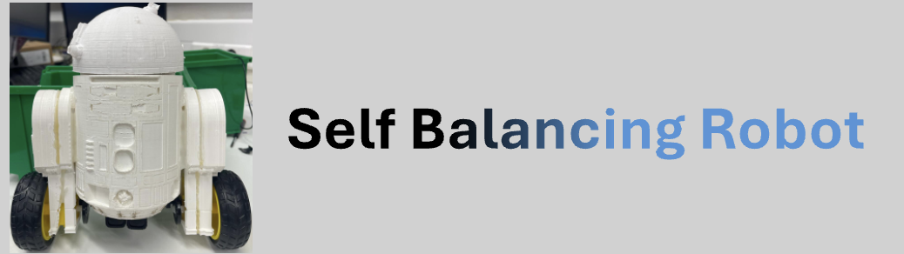
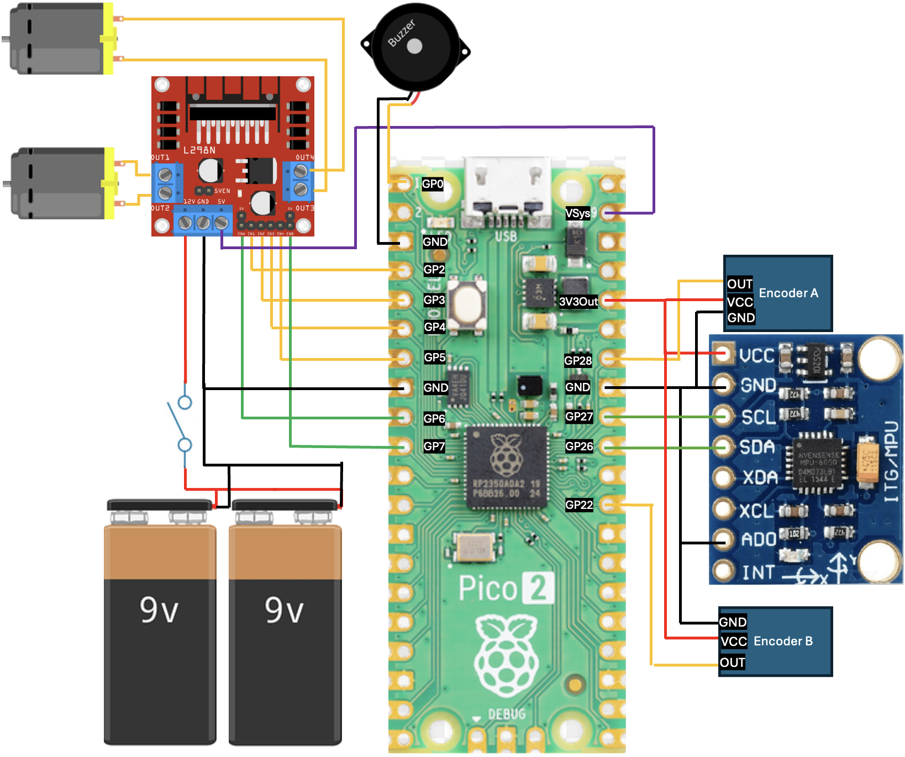
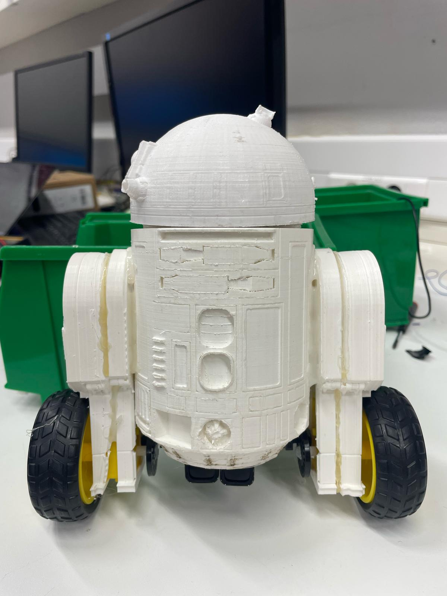
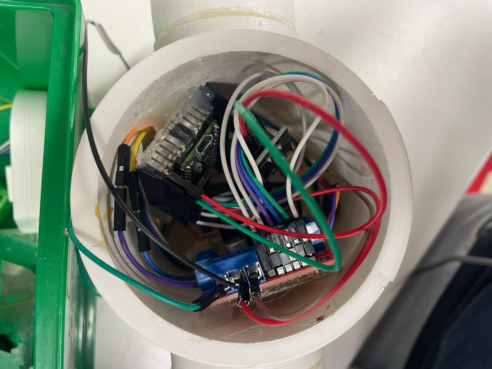
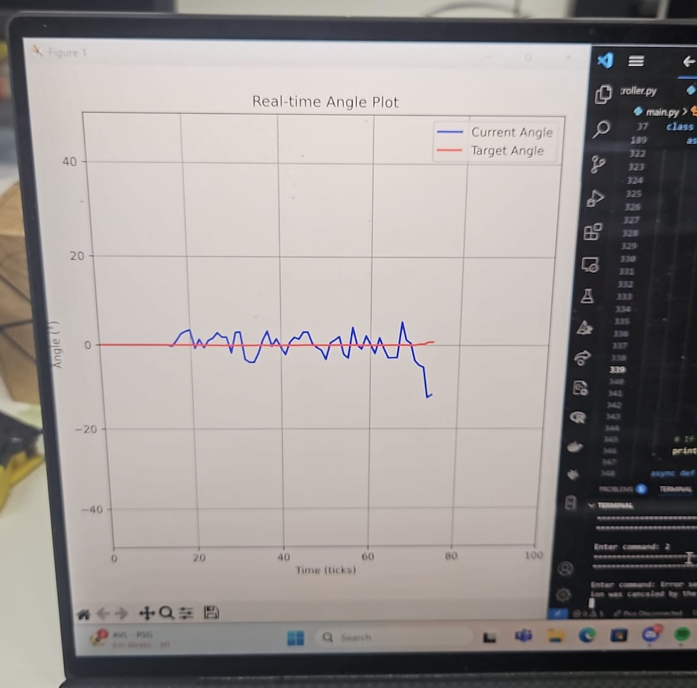

## 🗂️ Table of Contents

- [🚀 Project Overview](#project-overview)
- [🛠️ Hardware Components](#hardware-components)
- [🔌 Pinout Configuration](#pinout-configuration)
- [🧠 PID Control Theory](#pid-control-theory)
- [🧩 Software Architecture](#software-architecture)
- [⚙️ Setup and Configuration](#setup-and-configuration)
- [🎬 Demo](#demo)

## 🚀 Project Overview

This self-balancing robot is powered by the Raspberry Pi Pico W, combining real-time control, multiple sensors, and wireless communication into a compact robotics platform. Designed mainly for learning, experimentation, and for fun, it's an ideal entry point into the world of data acquisition, control systems, and embedded programming.

**Key Features:**
- **Real-Time Balancing:** Uses an MPU6050 IMU, Wheel encoders, and a robust PID controller to keep the robot upright.
- **Modular Architecture:** Clean separation of motor, sensor, control, and communication logic for easy extension and maintenance.
- **Bluetooth Remote Control:** Drive, tune, and calibrate your robot wirelessly via a simple command interface.
- **Live Parameter Tuning:** Adjust PID and balance parameters on the fly for rapid experimentation.
- **Sound & Feedback:** Play melodies (like the Star Wars theme!) and R2D2-style sounds with the onboard buzzer for interactive feedback.
- **Educational Focus:** Ideal for exploring robotics, control systems, and embedded programming.

## 🛠️ Hardware Components

- **Controller**: Raspberry Pi Pico 2 W (with Wi-Fi and Bluetooth)
- **Sensors**:
  - MPU6050 6-axis gyroscope and accelerometer (MPU9250 recommended)
  - 2 Wheel encoders 
- **Actuators**:
  - L298N motor driver 
  - 2 DC motors
  - Passive buzzer
- **Power**:
  - 2 9V Batteries 

## 🔌 Pinout Configuration

| Component         | Signal/Function   | Pico GPIO |
|-------------------|-------------------|-----------|
| Motor A (Left)    | IN1               | 2         |
| Motor A (Left)    | IN2               | 3         |
| Motor A (Left)    | ENA (PWM)         | 6         |
| Motor B (Right)   | IN3               | 4         |
| Motor B (Right)   | IN4               | 5         |
| Motor B (Right)   | ENB (PWM)         | 7         |
| MPU6050           | SDA               | 26        |
| MPU6050           | SCL               | 27        |
| Left Encoder      | Signal            | 22        |
| Right Encoder     | Signal            | 28        |
| Buzzer            | Signal            | 0         |

## 🧠 PID Control Theory

A PID (Proportional-Integral-Derivative) controller is a widely used feedback mechanism in control systems. The PID algorithm continuously calculates an error value — the difference between a desired setpoint (in this case upright balance) and a measured process variable (the actual tilt angle). It then applies corrective actions based on three terms:

- **Proportional (P)**: Reacts to the current error. A higher gain increases responsiveness but can lead to overshoot.

- **Integral (I)**: Accounts for the accumulation of past errors, helping to eliminate long-term bias, though too much can cause instability.

- **Derivative (D)**: Predicts future error by observing the rate of change, damping oscillations and improving stability.

In this robot, the PID controller processes real-time tilt data from an IMU (Inertial Measurement Unit) sensor, adjusting the motor power accordingly to keep the robot balanced. Proper tuning of the PID parameters is crucial to achieving a smooth and responsive behavior, and this can be done efficiently using reinforcement learning.

To reduce angle drift, wheel encoders are also employed. These encoders act as a reference point for the IMU, helping compensate for the natural drift that can occur with inertial sensors over time. This approach of combining inertial and wheel data improves the accuracy of position and movement estimation.

For even greater precision, the system can be upgraded with a 9-DOF (Degrees of Freedom) IMU, which includes an additional magnetometer. This allows the system to detect the Earth’s magnetic field and maintain a consistent heading, offering an external reference that helps correct long-term orientation drift and enhances overall sensor reliability.

## 🧩 Software Architecture

The codebase is organized into several modules, each with a clear responsibility to ensure modularity, maintainability, and ease of extension:

- [`src/raspberry/main.py`](src/raspberry/main.py):
  - **Entry point and main control loop.**
  - Initializes all controllers, handles Bluetooth commands, telemetry, and orchestrates the robot's operation.

- [`controllers/`](src/raspberry/controllers):
  - [`gyroscope_controller.py`](src/raspberry/controllers/gyroscope_controller.py):
    - Interfaces with the MPU6050 IMU to read angles and acceleration.
    - Provides sensor fusion and filtering for accurate orientation estimation.
  - [`motor_controller.py`](src/raspberry/controllers/motor_controller.py):
    - Low-level control of the DC motors via the L298N driver.
    - Supports PWM speed control and direction management.
  - [`balance_controller.py`](src/raspberry/controllers/balance_controller.py):
    - Implements the PID control loop for self-balancing.
    - Contains driving logic for speed and turning, and safety checks for tilt.
  - [`encoder_controller.py`](src/raspberry/controllers/encoder_controller.py):
    - Reads wheel encoder pulses to measure speed and distance.
    - Enables closed-loop speed control and odometry.
  - [`buzzer_controller.py`](src/raspberry/controllers/buzzer_controller.py):
    - Controls the passive buzzer for sound feedback.
    - Supports playing melodies and sound effects asynchronously.

- [`bluetooth/`](src/raspberry/bluetooth_controllers):
  - [`BLEReceiver.py`](src/raspberry/bluetooth_controllers/BLEReceiver.py):
    - Handles Bluetooth Low Energy (BLE) communication.
    - Receives commands and sends telemetry to a remote device.
  - [`BLEEmitter.py`](src/raspberry/bluetooth_controllers/BLEEmitter.py):
    - Used on the PC side to connect to the robot via BLE and plot a real-time graph of the robot's angle.

- [`parameters/`](src/raspberry/parameters):
  - [`parameters.py`](src/raspberry/parameters/parameters.py):
    - Central location for all system constants and configuration values.
    - Includes PID gains, hardware pin mappings, and calibration data.

- [`training/`](src/raspberry/training):
  - [`robot_interface.py`](src/raspberry/training/robot_interface.py):
    - Provides an interface for reinforcement learning experiments.
    - Allows external agents to interact with the robot for training and evaluation.

- [`full_bluethooth_pc.py`](src/raspberry/full_bluethooth_pc.py):
  - **PC entrypoint script.**
  - Run this on your computer to connect to the Pico via BLE and interact with the robot, including plotting and telemetry.

**Typical Data Flow:**
1. Sensor data (IMU, encoders) is read by controller modules.
2. The balance controller computes motor commands using PID logic.
3. Motor controller actuates the motors accordingly.
4. BLEReceiver handles incoming commands and outgoing telemetry.
5. Buzzer controller provides sound feedback for events and status.

## ⚙️ Setup and Configuration

1. **Hardware Assembly**:
   - Connect components according to the pinout configuration
   - Mount the MPU6050 at the center of gravity, with X axis aligned to the forward direction

2. **Software Installation**:
   - Install MicroPython on the Raspberry Pi Pico
   - Upload all project files to the Pico

3. **Initial Configuration**:
   - Run [`full_bluethooth_pc.py`](src/raspberry/full_bluethooth_pc.py) to connect via bluetooth to the robot
   - Customize [`parameters/parameters.py`](src/raspberry/parameters/parameters.py) or via bluetooth as needed for your specific case
   - Initial calibration is required before first use

## 🎬 Demo

https://github.com/user-attachments/assets/decdff71-1c61-4fef-afbe-19137b25a101

  
  
  

